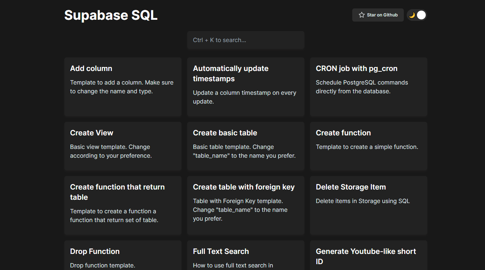

<!-- PROJECT LOGO -->
<br />
<p align="center">
  <a href="https://github.com/zernonia/supabase-sql">
    
  </a>

  <h3 align="center">Supabase SQL</h3>

  <p align="center">
    Simple Curated <strong><a href="https://supabase.io/">Supabase</a> SQL</strong>
    <br />
    <br />
    <a href="https://supabase-sql.vercel.app/">View Demo</a>
    ·
    <a href="https://github.com/zernonia/supabase-sql/issues">Report Bug</a>
    ·
    <a href="https://github.com/zernonia/supabase-sql/issues">Request Feature</a>
  </p>
</p>

  <p align="center">
<a href="https://github.com/zernonia/supabase-sql/blob/master/LICENSE" target="blank">

</a>
<a href="https://github.com/zernonia/supabase-sql/stargazers" target="blank">

</a>
<a href="https://github.com/zernonia/supabase-sql/issues" target="blank">

</a>
<a href="https://github.com/zernonia/supabase-sql/pulls" target="blank">

</a>
<a href="https://twitter.com/intent/tweet?text=Check%20out%20supabase-sql.vercel.app%20SQL%20by%20@zernonia.%20Curated%20list%20of%20Supabase%E2%9A%A1%20SQL%20to%20help%20you%20find%20the%20script%20you%20need!"></a>

</p>

[](https://supabase-sql.vercel.app/)

## 🚀 Features

- 📃 Curated list of SQL script
- 🧪 Tested script
- 🏂 Easy copy & paste
- 🌜 Dark mode

## 📇 About The Project

This project aims to help Supabase users to find the SQL script they needed at ease. Yes they could look it up online, but some of the scripts is already outdated, and most probably wouldn't work in Supabase.

Thus, I've decided to take this opportunity to build this **Open Source, Free, Curated list** of Supabase SQL 🔥

### 🔨 Built With

- [Nuxt](http://nuxtjs.org/)
- [Vite](https://vitejs.dev/)
- [WindiCSS](https://windicss.org/)

Remeber to ⭐ this repo if you ❤ this Apps

## 🌎 Local Development

### Prerequisites

Yarn

- ```sh
  npm install --global yarn
  ```

### Development

1. Clone the repo
   ```sh
   git clone https://github.com/zernonia/supabase-sql.git
   ```
2. Install NPM packages
   ```sh
   yarn install
   ```
3. Run Development instance
   ```sh
   yarn dev
   ```

## ➕ Contributing

Contributions are what make the open source community such an amazing place to be learn, inspire, and create. Any contributions you make are **greatly appreciated**.

1. Fork the Project
2. Create your Feature Branch (`git checkout -b feature/AmazingFeature`)
3. Commit your Changes (`git commit -m 'Add some AmazingFeature'`)
4. Push to the Branch (`git push origin feature/AmazingFeature`)
5. Open a Pull Request

## 📈 Analytics

I'm using [Umami Analytics](https://umami.is/docs/about) because I'm interested in the distributions of user who uses Supabase and this tool.

[This](https://umami-zernonia.vercel.app/share/TGwbD76i/Supabase%20SQL) is the public URL for the analytics. Enjoy!

## 📜 License

Not Associated with Supabase.

Distributed under the MIT License. See `LICENSE` for more information.

# 📧 Contact

Zernonia - [@zernonia](https://twitter.com/zernonia)

Also, if you like my work, please buy me a coffee ☕😳

<a href="https://www.buymeacoffee.com/zernonia" target="_blank">
    
  </a>
